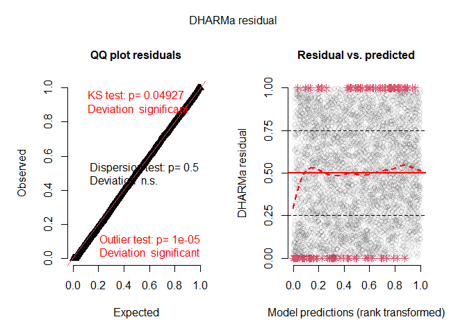

<!-- README.md is generated from README.Rmd. Please edit that file -->

# ewp

<!-- badges: start -->

[](https://github.com/pboesu/ewp/actions)
[](https://app.codecov.io/gh/pboesu/ewp?branch=main)
<!-- badges: end -->

The goal of ewp is to provide a modelling interface for underdispersed
count data based on the exponentially weighted Poisson (EWP)
distribution described by Ridout & Besbeas (2004), allowing for
nest-level covariates on the location parameter

of the EWP. Currently only the three-parameter version of the
distribution (EWP_3) is implemented.

## Installation

You can install the development version of ewp directly from github like
so (requires a working C++ compiler toolchain):

``` r
remotes::install_github('pboesu/ewp')
```

## Example

The package contains a reconstructed version of the linnet dataset from
Ridout & Besbeas (2004), which consists of 5414 clutch size records and
is augmented with two synthetic covariates, one that is random noise,
and one that is correlated with clutch size. The parameter estimates for
the intercept-only model presented in Ridout & Besbeas (2004) can be
reproduced like so:

``` r
library(ewp)
fit_null <- ewp_reg(eggs ~ 1, data = linnet)# this may take a few seconds
#> start values are: 
#> (Intercept)       beta1       beta2 
#>    1.546823    0.000000    0.000000 
#> initial  value 9530.456809 
#> iter   4 value 5324.797069
#> iter   8 value 5299.393228
#> final  value 5299.362098 
#> converged
#> 
#> Calculating Hessian. This may take a while.
summary(fit_null)
#> Deviance residuals:
#> 
#> lambda coefficients (ewp3 with log link):
#>             Estimate Std. Error z value Pr(>|z|)    
#> (Intercept) 1.584650   0.003511   451.3   <2e-16 ***
#> ---
#> Signif. codes:  0 '***' 0.001 '**' 0.01 '*' 0.05 '.' 0.1 ' ' 1
#> 
#> dispersion coefficients:
#>       Estimate Std. Error z value Pr(>|z|)    
#> beta1  1.46441    0.05588   26.21   <2e-16 ***
#> beta2  2.35681    0.05607   42.04   <2e-16 ***
#> ---
#> Signif. codes:  0 '***' 0.001 '**' 0.01 '*' 0.05 '.' 0.1 ' ' 1
#> 
#> Number of iterations in  optimization: 11 
#> Log-likelihood: -5299 on 3 Df
```

Note that the linear predictor on

uses a log-link.

A model with nest-level covariates can be fitted by specifying a more
complex model formula - as in the base R `glm()`

``` r
fit <- ewp_reg(eggs ~ cov1 + cov2, data = linnet)# this may take 5-10 seconds
#> start values are: 
#>  (Intercept)         cov1         cov2        beta1        beta2 
#>  1.204279467 -0.001259307  0.071872488  0.000000000  0.000000000 
#> initial  value 9434.616462 
#> iter   4 value 5054.429651
#> iter   8 value 4596.004461
#> iter  12 value 4440.611768
#> iter  16 value 4423.783976
#> iter  20 value 4420.081202
#> iter  20 value 4420.081199
#> iter  20 value 4420.081199
#> final  value 4420.081199 
#> converged
#> 
#> Calculating Hessian. This may take a while.
summary(fit)
#> Deviance residuals:
#> 
#> lambda coefficients (ewp3 with log link):
#>               Estimate Std. Error z value Pr(>|z|)    
#> (Intercept)  1.3335734  0.0048514 274.883   <2e-16 ***
#> cov1        -0.0007823  0.0014025  -0.558    0.577    
#> cov2         0.0532956  0.0009553  55.791   <2e-16 ***
#> ---
#> Signif. codes:  0 '***' 0.001 '**' 0.01 '*' 0.05 '.' 0.1 ' ' 1
#> 
#> dispersion coefficients:
#>       Estimate Std. Error z value Pr(>|z|)    
#> beta1  1.89858    0.04404   43.11   <2e-16 ***
#> beta2  3.05108    0.08761   34.83   <2e-16 ***
#> ---
#> Signif. codes:  0 '***' 0.001 '**' 0.01 '*' 0.05 '.' 0.1 ' ' 1
#> 
#> Number of iterations in  optimization: 20 
#> Log-likelihood: -4420 on 5 Df
```

Simulation based residual diagnostics are indirectly available through
the package [DHARMa](https://cran.r-project.org/package=DHARMa), by
using the `simulate.ewp` method:

``` r
library(DHARMa)
#> Warning: package 'DHARMa' was built under R version 4.2.2
#> This is DHARMa 0.4.6. For overview type '?DHARMa'. For recent changes, type news(package = 'DHARMa')
#simulate from fitted model
sims <- simulate(fit, nsim = 20)

#create a DHARMa abject
DH <- createDHARMa(simulatedResponse = as.matrix(sims),#simulated responses
                   observedResponse = linnet$eggs,#original response
                   fittedPredictedResponse = fit$fitted.values,#fitted values from ewp model
                   integerResponse = T)#tell DHARMa this is a discrete probability distribution

#plot diagnostics
plot(DH)
#> DHARMa:testOutliers with type = binomial may have inflated Type I error rates for integer-valued distributions. To get a more exact result, it is recommended to re-run testOutliers with type = 'bootstrap'. See ?testOutliers for details
```



:warning: **Note that the maximum likelihood optimisation procedure is
still experimental** :warning:

In particular:  
- At the moment **the likelihood evaluation is optimised for small
counts
(
\<\< 20) and uses a hard upper limit of 30 for potential counts**, this
means the model is currently only suitable for datasets with expected
counts up to 20-25, depending on the degree of underdispersion. A
warning is issued if this criterion in not met when using `ewp_reg()`,
but other functions may fail silently. - Fitting is very slow (think
minutes, not seconds), especially when estimating the Hessian matrix for
more than a couple of parameters! - Estimates may not be stable for
models with many covariates and/or very large sample sizes (1000s).
**Centering and scaling continuous covariates seems to help on that
front.**

:warning::warning::warning:
